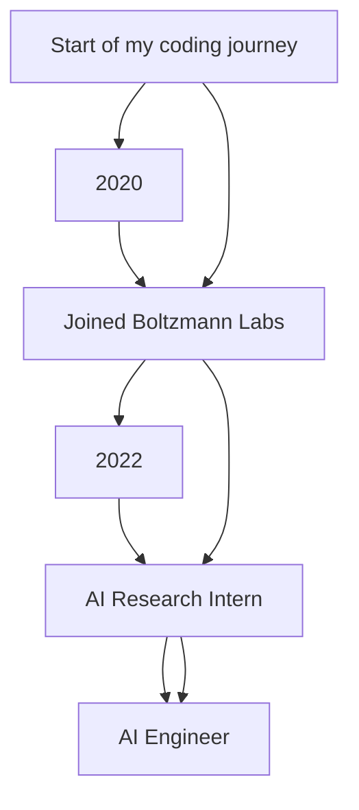

<h1 align="center">Hi, I'm Haripreeth Dwarakanath Avarur 👋</h1>

<p align="center">
    
    
    
</p>

---

### 🌟 About Me

I'm a passionate **AI Research Engineer** and **Problem Solver** based in Bengaluru, India. My focus spans across **AI agents**, **multi-agent systems**, and **cutting-edge healthcare solutions**. I thrive in environments where **innovation** meets **impact**.

- 🎓 **B. Tech in Computer Science & Engineering** from SRMIST with a GPA of 9.55
- 🚀 Developed AI systems in **clinical trials** and **multi-omics data integration**
- 🔥 Deep interest in **quantum computing** and its fusion with **AI/ML**
- 💡 Currently building an **open-source AI library** at **Boltzmann Labs**

---

### 🧠 My Expertise

```yaml
- Programming: Python, C++, SAP ABAP, SQL
- AI Frameworks: TensorFlow, PyTorch, Keras
- Data Science: Pandas, NumPy, Scikit-Learn, Seaborn, Matplotlib
- Cloud & DevOps: AWS, Docker, Terraform, Ansible
- Quantum Computing: Qiskit, Linear Algebra
```

---

### 📊 My GitHub Stats


---

### 🔥 My Projects

Here are a few standout projects I've been part of:

| Project                       | Technologies | Highlights |
| ------------------------------| ------------ | ---------- |
| **Dental Caries Segmentation** | `TensorFlow, Keras` | Built an AI system to detect dental caries in X-ray images, improving diagnostic accuracy |
| **Human Gait Recognition**     | `MobileNet, InceptionNet` | Developed a human gait recognition system, achieving **98.75% accuracy** using MobileNetV2 |
| **AI Patient Matching**        | `NLP, Deep Learning` | Automated patient matching for clinical trials with **real-world datasets** |

---

### 🔧 Technologies I Use

<p align="center">
    
    
    
    
</p>

---

### 🚀 My Journey So Far



---

### 📈 Contribution Graph


---

### 🏆 Achievements

- 📝 **Patent Holder**: Healthcare analytics technology for dental imaging.
- 📚 **Research Publications**:
  - **SRMDent: Dental Carries Segmentation using RAU-Net**
  - **Human Gait Recognition using Cross-View Micro Gait Dataset**

---

### 🎯 Let's Connect!

I'm always open to collaborations and new challenges. If you want to discuss tech, AI, or quantum computing, feel free to reach out!

- 💼 [LinkedIn](https://www.linkedin.com/in/haripreeth-avarur)
- 💻 [GitHub](https://github.com/HaripreethAvarur)

---

<p align="center">
  
  
</p>
