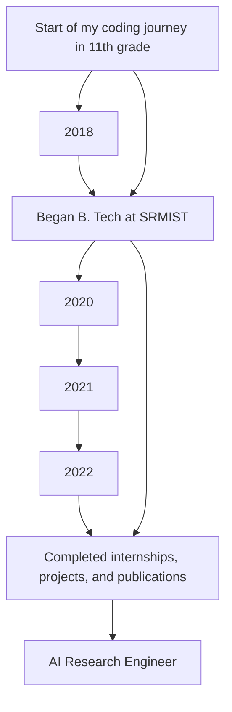

<h1 align="center">Hi, I'm Haripreeth Dwarakanath Avarur 👋</h1>

<p align="center">
    
    
    
</p>

---

### 🌟 About Me

- 👨‍💻 **AI Research Engineer** with a passion for **problem-solving** and innovation
- 🌍 Interested in leveraging **AI/ML** for **healthcare**, **space technology**, **agriculture**, **renewable energy**, and **climate solutions**
- 🔭 Strong interest in **quantum computing** and its potential to revolutionize **AI/ML**
- 💡 Thrives in environments where **cutting-edge innovation** meets **real-world impact**
- 🎓 **B. Tech in Computer Science & Engineering** from SRMIST

---

### 🧠 My Expertise

```yaml
- Programming: Python, C++, SAP ABAP, SQL
- AI Frameworks: TensorFlow, PyTorch, Keras, OpenCV
- Data Science: Pandas, NumPy, Scikit-Learn, Seaborn, Matplotlib
- Cloud & DevOps: AWS, Docker, Terraform, Ansible
- Quantum Computing: Qiskit, Linear Algebra
```

---

### 📊 My GitHub Stats


---

### 🔧 Technologies I Use

<p align="center">
    
    
    
    
</p>

---

### 🚀 My Journey So Far



---

### 🏆 Achievements

- 📚 **Research Publications**:
  - **SRMDent: Dental Carries Segmentation using RAU-Net**
  - **Human Gait Recognition using Cross-View Micro Gait Dataset**

---

### 🎯 Let's Connect!

I'm always open to collaborations and new challenges. If you want to discuss tech, AI, or quantum computing, feel free to reach out!

- 💼 [LinkedIn](https://www.linkedin.com/in/haripreeth-avarur)
- 💻 [GitHub](https://github.com/HaripreethAvarur)
- ✉️ [Email](mailto:hari.avarur@gmail.com)

---
