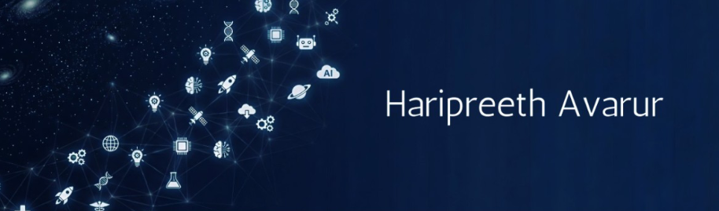
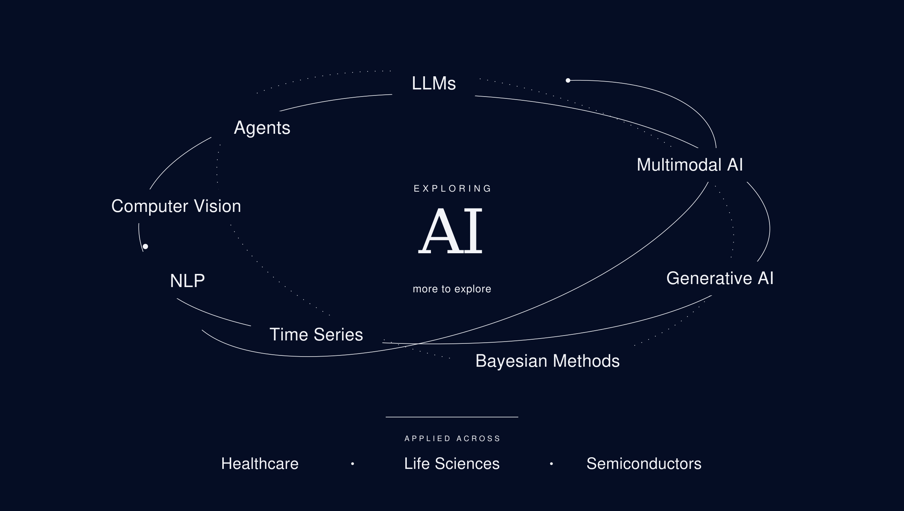

  

 

Hi, I'm Haripreeth.

I build things because I want them to matter. Most of my work lives where AI meets health and the sciences: precision medicine, disease modeling, clinical decision tools, scientific discovery. I'm a perpetual learner, always reading, always experimenting, always pulling apart some new model, tool, or framework just to see how it ticks.

Right now I'm doing an MS in Computer Science and Engineering at the University of Michigan.

The part I actually love is the niches, the small specific corners of AI where one careful idea makes a real difference. And I've wandered through a lot of those corners.

## Where I've worked across AI

  

**Vision.** From medical images (a dental caries segmentation model that led to a filed patent and a published paper, plus cross-view gait recognition) to industrial inspection (transfer learning for semiconductor wafer defect detection on painfully scarce labels) to audio-visual systems (working out who is speaking in a video).

**Language and LLMs.** Pulling structured data out of messy clinical notes, auditing LLM-written summaries against clinician gold standards, framing patient-to-trial eligibility as natural language inference, and semantic search over clinical trials. A fair bit of this is clinical NLP work at Michigan Medicine.

**Agents.** I lead [MASLibPy](https://github.com/bayeslabs/maslibpy), an open-source library for multi-agent reasoning (on PyPI), and built the agent orchestration layer inside a clinical-trial platform. I also led a hackathon team that built an agentic retrosynthesis planner.

**Science and health.** This is the center of gravity. Counterfactual epidemic scenario modeling in a research lab, multi-omics models for cancer drug response, digital-twin models of disease progression, and current research on how agents share information, aimed eventually at genomics. Most of it is about causal structure and uncertainty, not just prediction.

**Systems and inference.** Getting models to actually run: parameter-efficient fine-tuning, quantization and inference benchmarking, distributed training, and HPC.

**Quantum.** An earlier chapter. I led a 25-member quantum computing club, taught the linear algebra and the basics, and still keep a Qiskit repo or two around.

## A few highlights

- A **patent** (filed) for a dental caries detection method
- Two **first-author IEEE publications** (medical image segmentation, gait recognition)
- **[MASLibPy](https://github.com/bayeslabs/maslibpy)**, an open-source multi-agent library, published on PyPI
- **Runner-up** at the Merck / AWS / NASSCOM Spark-N-Elevate hackathon (agentic retrosynthesis)

## Always experimenting

Whatever I'm currently playing with lives here, and the list keeps changing:

`Python` · `PyTorch` · `TensorFlow` · `Transformers & LLMs` · `OpenCV` · `GNNs` · `Kalman / particle filters` · `ONNX / TensorRT` · `Docker` · `AWS` · `HPC`

## A few things I've built

Small and public, more sketches than showcases:
[ProjectLip](https://github.com/HaripreethAvarur/ProjectLip_ActiveSpeakerDetection) ·
[SmartShelf](https://github.com/HaripreethAvarur/SmartShelf) ·
[maslibpy](https://github.com/HaripreethAvarur/maslibpy) ·
[talking-plant](https://github.com/HaripreethAvarur/talking-plant)

## Say hi

[LinkedIn](https://www.linkedin.com/in/haripreeth-avarur/) · hari.avarur@umich.edu
